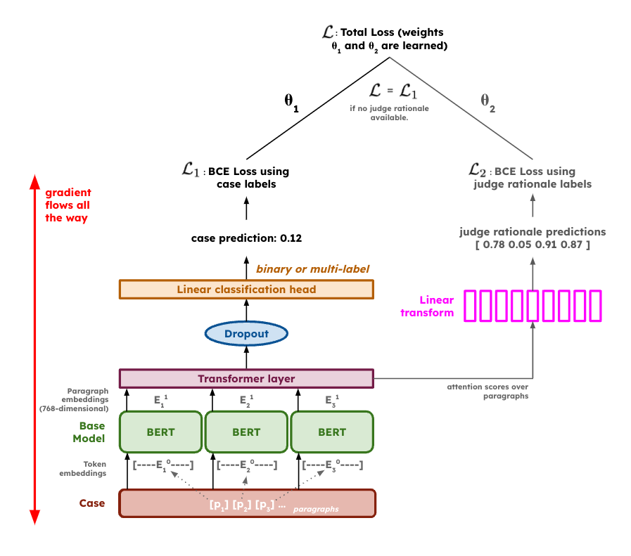

# From RoBERTa to aLEXa: Automated Legal Expert Arbitrator for Neural Legal Judgment Prediction

**Authors**: Lukas Haas, Michal Skreta

This repository contains the code to our CS 224N Final Project.

## Abstract

Neural models have shown promise in redefining the field of legal judgment prediction (LJP), serving as an aid for judges while helping citizens assess the fairness of judgments. Previous neural LJP approaches on binary and multi-label classification tasks, however, relied on outdated language models and faulty hyperparameters. Beyond improving state-of-the-art results in both a binary and the multi-label setting by fine-tuning large language models, we introduce aLEXa, a multi-task hierarchical language model with self-learning loss weights and attention forcing, teaching the model what legal facts to pay most attention to. Additionally, we improve the explainability of LJP models through paragraph attention weighting visualizations, allowing us to qualitatively assess the quality of legal predictions in addition to traditional quantitative metrics. Our results underscore the potential of NLP approaches to redefine traditional judicial decision-making and show promise of the efficacy of hierarchical and domain fine-tuned language models.

## Poster

View our project poster [here](Submissions/CS%20224N%20Final%20Project%20Poster.pdf).

## Final Report

View our final report [here](Submissions/CS224N_Project_Final_Report___Haas_and_Skreta__2022_.pdf).

## Quickstart

The `run.py` file in the `Code/src` directly contains the logic to load and train most models. The following are some examples:

### Training Models

All of the following examples can be run by setting the `--objective` flag to either `binary` or `multilabel` depending on the desired task.

**Finetuning BERT, RoBERTa, or LEGAL-BERT**:

Note that the name, i.e. `bert-base-uncased` must be a valid Hugging Face model identifier.

`python run.py finetune bert-base-uncased --data path/to/data --objective binary`

**Training a Hierarchical Model with BERT, RoBERTa, or LEGAL-BERT as a Base**:

`python run.py finetune bert-base-uncased --hierarchical --data path/to/data --objective binary`

**Training Automated Legal Expert Arbitatror (aLEXa) with BERT, RoBERTa, or LEGAL-BERT as a Base**:

`python run.py finetune bert-base-uncased --alexa --data path/to/data --objective binary`

### Currently Supported Additional Flags

* `--evaluate, -e`: evaluate the model on the test split after it has been loaded or trained.
* `--sample, -s n`: finetune or evaluate the model only on a random subset (seeded) of the data, looking at only `n` samples.
* `--output, -o xyz`: specifies the output directory for trained models.

### Load a Model from Disk to Evaluate it on the Test Set

`python run.py load path/to/model --base-model bert-base-uncased --data path/to/data --objective binary --evaluate`

### Load a Model from Disk to further Finetune

`python run.py loadtune path/to/model --base-model bert-base-uncased --data path/to/data --objective binary --evaluate`

 
## Automated Legal Expert Arbitrator (aLEXa)

We introduce aLEXa, a multi-task hierarchical language model with self-learning loss weights and attention forcing as our main contribution to the field of neural legal judgement prediction. The following is the model's architecture:

